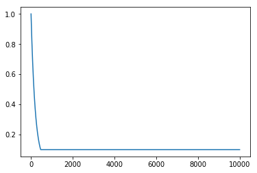
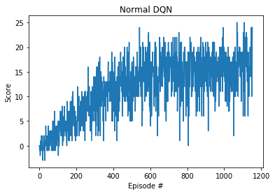
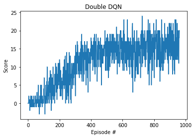
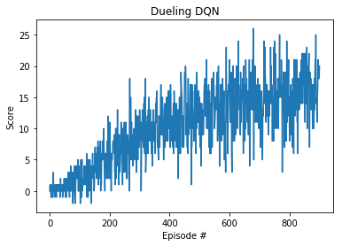
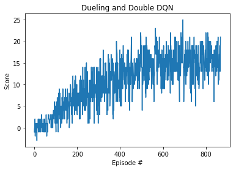
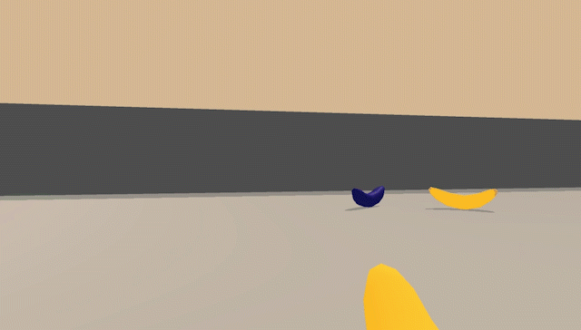
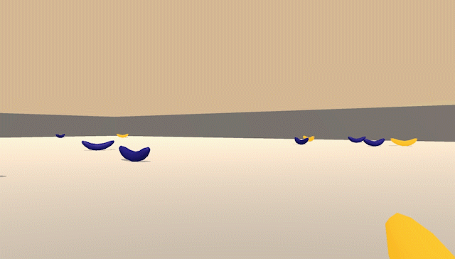

# Banana Navigation Report

### Algorithm

Three algorithms were attempted for this project: vanilla DQN, double DQN, and dueling DQN.

All algorithms use two mirrored neural networks, one target network and one online network. The target network is updated with the online network parameters using a soft update with hyperparameter tau.

These networks used an epsilon-greedy policy to select the action. And the network uses experience replay to sample a batch.

The online network parameters are optimized with Adam. MSE was used for the loss function.

The dueling DQN implementation splits the neural network into a value network and an advantage network. It selects the action based on the value, advantage, and advantage mean.

The double DQN utilizes different networks to determine the maximizing action and to estimate the value of taking that action.

#### Network Setup

The standard network was used three linear nodes:
- input node: fully connected node with 37 inputs and 64 outputs
- hidden node: fully connected node with 64 inputs and 64 outputs
- output node: fully connected node with 64 inputs and 4 outputs

The input and hidden nodes used a ReLU activation function and the output node used a linear activation function.

The dueling DQN setup used a branching network. Both branches used a fully connected input node with 37 inputs, 64 outputs, and a ReLU activation function.

Both the advantage and value branches used a fully connected hidden node with 64 inputs, 64 outputs and ReLU activation.

The value branch used a fully connected output node with 64 inputs, 1 output, and linear activation.

The advantage branch used a fully connected output node with 64 inputs, 4 outputs, and linear activation.

The output of the forward pass used the formula `value + advantage - mean(advantage)`

#### Hyperparameters

The hyperparameters used by the agent were the following:
- Batch size: 64
- Learning Rate: 0.0005
- Tau: 0.001
- Gamma: 0.99
- Replay Buffer Size: 1e5

To train the agent, a max timestep of 300 was used. Epsilon was decayed from `1.0` over the framerate using a minimum of `0.1` and a decay of `0.995`.

A plot of epsilon against timestep follows:



### Results

The following were the results obtained using the settings mentioned above.

#### Normal DQN

The normal DQN achieved a score of 13 over the last 100 consecutive episodes within **530** episodes.

It achieved a score of 16 within **1153** episodes.



```
Episode 100	Average Score: 0.99
Episode 200	Average Score: 4.14
Episode 300	Average Score: 7.26
Episode 400	Average Score: 10.69
Episode 500	Average Score: 12.37
Episode 530	Average Score: 13.03
Environment solved in 530 episodes!	Average Score: 13.03
Episode 600	Average Score: 14.28
Episode 700	Average Score: 14.55
Episode 800	Average Score: 15.10
Episode 900	Average Score: 14.75
Episode 1000	Average Score: 15.78
Episode 1100	Average Score: 14.95
Episode 1153	Average Score: 16.07
Environment 16+ in 1153 episodes!	Average Score: 16.07
```

#### Double DQN

The double DQN achieved a score of 13 over the last 100 consecutive episodes within **452** episodes. It was able to solve the task 78 episodes faster than vanilla DQN.

It achieved a score of 16 within **961** episodes. Almost 200 episodes faster than vanilla DQN.



```
Episode 100	Average Score: 0.52
Episode 200	Average Score: 4.42
Episode 300	Average Score: 7.13
Episode 400	Average Score: 11.77
Episode 452	Average Score: 13.01
Environment solved in 452 episodes!	Average Score: 13.01
Episode 500	Average Score: 14.03
Episode 600	Average Score: 14.81
Episode 700	Average Score: 14.33
Episode 800	Average Score: 15.21
Episode 900	Average Score: 15.52
Episode 961	Average Score: 16.01
Environment 16+ in 961 episodes!	Average Score: 16.01
```

#### Dueling DQN

The dueling DQN achieved a score of 13 over the last 100 consecutive episodes within **601** episodes. It was slower than both vanilla DQN and double DQN algorithms to reach this benchmark.

It achieved a score of 16 within **901** episodes which was an improvement over the others.



```
Episode 100	Average Score: 0.71
Episode 200	Average Score: 3.64
Episode 300	Average Score: 7.15
Episode 400	Average Score: 10.45
Episode 500	Average Score: 11.73
Episode 600	Average Score: 12.98
Episode 601	Average Score: 13.04
Environment solved in 601 episodes!	Average Score: 13.04
Episode 700	Average Score: 14.27
Episode 800	Average Score: 14.96
Episode 900	Average Score: 15.97
Episode 901	Average Score: 16.08
Environment 16+ in 901 episodes!	Average Score: 16.08
```

#### Hybrid DQN (Dueling + Double)

The mix of both double and dueling DQNs achieved a score of 13 over the last 100 consecutive episodes within **503** episodes. It was faster than the vanilla DQN, but slower than the double DQN algorithms to reach this benchmark.

It achieved a score of 16 within **869** episodes which yielded the fastest achievement of this benchmark of the tests.



```
Episode 100	Average Score: 1.06
Episode 200	Average Score: 5.14
Episode 300	Average Score: 8.01
Episode 400	Average Score: 10.81
Episode 500	Average Score: 12.76
Episode 503	Average Score: 13.04
Environment solved in 503 episodes!	Average Score: 13.04
Episode 600	Average Score: 14.25
Episode 700	Average Score: 15.15
Episode 800	Average Score: 15.42
Episode 869	Average Score: 16.02
Environment 16+ in 869 episodes!	Average Score: 16.02
```

#### Trained Agent Replay

##### Normal DQN Snippet



##### Full Video Replay

For a full video of all the different algorithms head to the [RL Agent Replay](https://vimeo.com/313428194).

##### Replay Analysis

The replays were enlightening. For the most part, the agents performed admirably within the environment.

Occasionally, the agent would get stuck in an oscillation pattern like the following:



Note, this is not an artifact of the GIF repeating. This appears to happen when a yellow banana is in the bottom left or right corner.

My hypothesis is that the ray casts used to detect objects have blind spot in these corners. Pixel-based training would likely address this if it is the issue. See below for results.

### Future Work

#### Algorithm Improvements

Improving upon the DQN algorithm is an area of active research, so there are a number of improvements available.

Here are some planned improvements for future iterations:
- [Prioritized Experience Replay](https://arxiv.org/abs/1511.05952)
- [Noisy Networks for Exploration](https://arxiv.org/abs/1706.10295)
- [Rainbow DQN](https://arxiv.org/abs/1710.02298)
